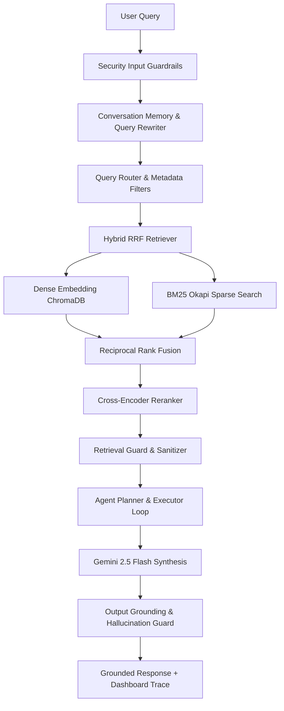

# Placement RAG Agent — Observable Production Agentic RAG Platform

An enterprise-grade, observable **Agentic Retrieval-Augmented Generation (RAG)** platform designed for AI interviews and engineering demonstrations. This platform showcases advanced GenAI architecture, multi-stage retrieval pipelines, agent reasoning traces, real-time feature toggles, and layered defense-in-depth security guardrails.

---

## 🏛 Architecture & Core Highlights



### 1. Modular Agentic RAG Backend (`backend/core/`)
- **Hybrid Retrieval**: Combines Dense (`text-embedding-004` + `ChromaDB`) and Sparse (`BM25Okapi`) retrieval via **Reciprocal Rank Fusion (RRF)**.
- **Cross-Encoder Reranking**: Uses `cross-encoder/ms-marco-MiniLM-L-6-v2` to re-score candidate chunks with semantic entailment.
- **Agent Reasoning Loop**: Structured iterative planning (`AgentPlanner` and `AgentExecutor`) with sub-query decomposition, evidence evaluation, and multi-hop retrieval.
- **Contextual Query Rewriting**: Resolves conversational pronouns and references across session turns.
- **Hypothetical Document Embeddings (HyDE)**: Generates hypothetical ideal answers to bridge semantic vocabulary gaps.

### 2. Developer Dashboard & Live Feature Toggles (`src/DeveloperDashboard.jsx`)
Inspect and compare system behavior in real time by enabling or disabling pipeline stages without restarting the server:
- Dense Retrieval | BM25 Retrieval | Hybrid RRF | Cross-Encoder Reranking
- Metadata Filtering | HyDE | Conversation Memory | Query Rewriting | Agent Planning Loop | Multi-Hop Retrieval | Chunk Enhancement

### 3. Layered Defense-In-Depth Security (`security/`)
- **Input Guardrails**: Length limits, normalization, prompt injection detection (`PromptInjectionDetector`).
- **Retrieval Guardrails**: Sanitizes retrieved chunks against indirect prompt injection (`RetrievalGuard`).
- **Output Guardrails**: Filters sensitive data leakage and enforces semantic grounding / hallucination checks (`GroundingVerifier`, `HallucinationGuard`).

---

## 🚀 Quickstart & Installation

### 1. Environment Setup
Clone the repository and configure your environment:
```bash
cp .env.example .env
# Edit .env and insert your GEMINI_API_KEY
```

### 2. Backend & Ingestion Pipeline
Activate your Python virtual environment and build the document index from `data/`:
```bash
# Run the ingestion CLI to process PDFs and build ChromaDB index
python -m backend.ingestion.build_index --data-path data/ --strategy recursive --chunk-size 500

# Run the backend server
uvicorn backend.app.main:app --host 127.0.0.1 --port 8000 --reload
```

### 3. Frontend Application
```bash
npm install
npm run dev
```
Open `http://localhost:5173` to interact with the Agentic RAG Platform and inspect the **Developer Dashboard**.

---

## 🧪 Security & Observability Tests

Run the full security guardrail regression test suite:
```bash
python -m pytest tests/security -v
```
All 28 defense-in-depth tests pass with zero regressions.

---

## 📊 API Reference

- `POST /chat` — Main conversation endpoint returning grounded answers and structured `pipeline_data`.
- `GET /pipeline-status/{request_id}` — Server-Sent Events (SSE) stream of live pipeline stages.
- `GET /dashboard/{request_id}` — Detailed telemetry, reasoning traces, ranking shifts, and latency breakdown.
- `GET /config` & `POST /config` — Inspect and modify active feature toggles on the fly.
- `GET /vector-db/stats` — Real-time index statistics and metadata distribution.
